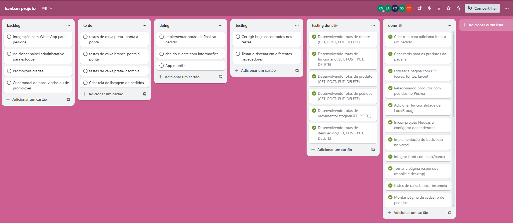
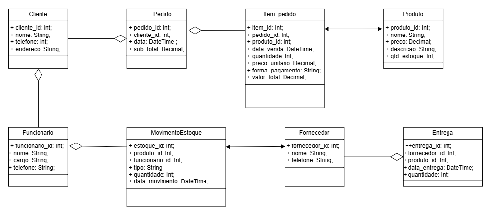
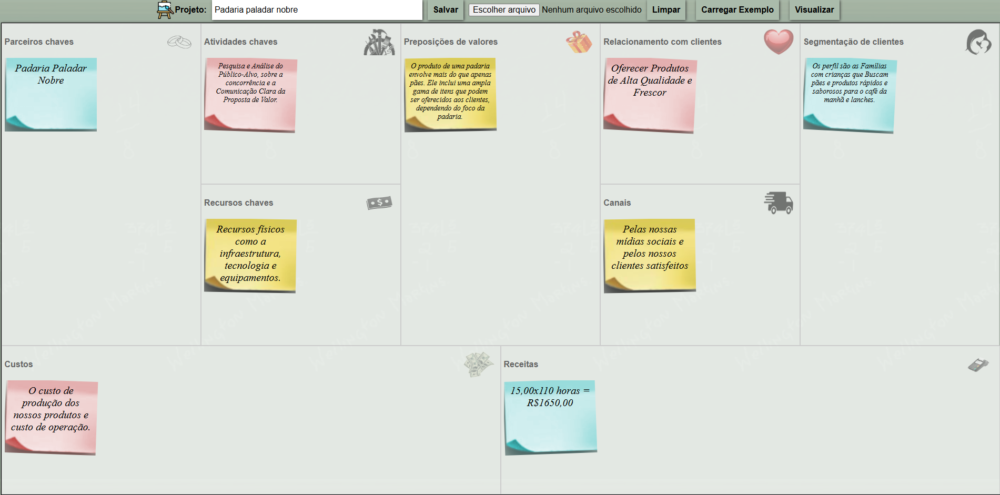
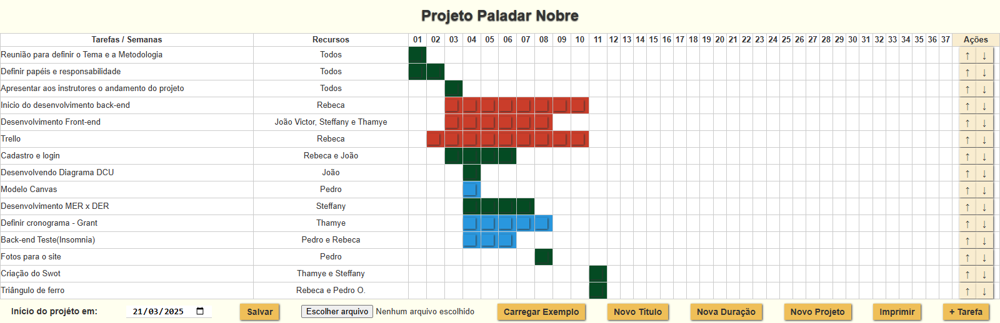
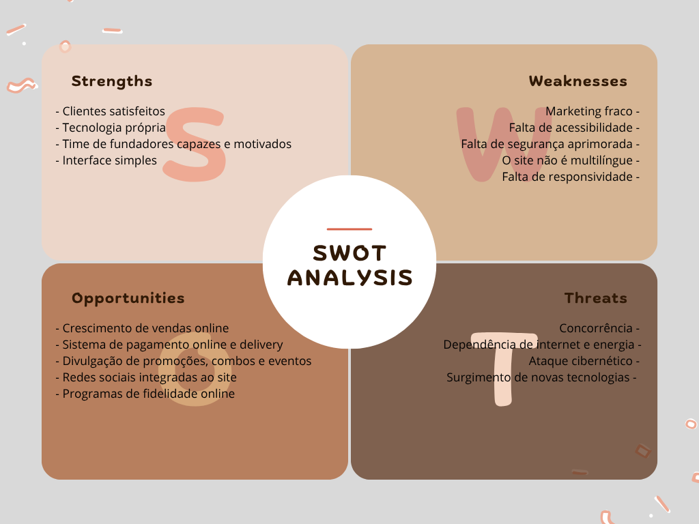
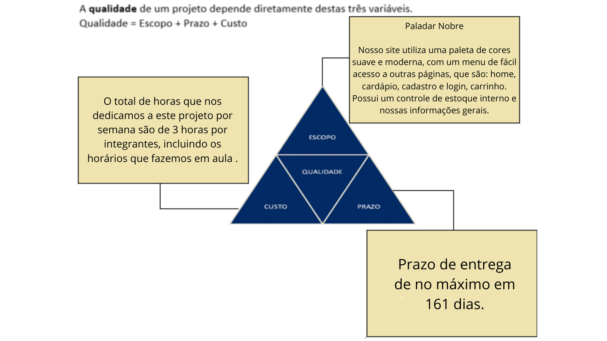

# Projeto-padaria-2025

# **Integrantes**
-  [Rebeca Lima](https://github.com/Rebecaalimaa)
- [Steffany Giovanna](https://github.com/steffanygiovanna)
- [João Angra](https://github.com/joaoangra)
- [Thamye Souza](https://github.com/thamyeS)
- [Pedro Oliveira](https://github.com/Pedrokk52)

## Backlog do Projeto final

### 1º Sprint
- [x] Escolher a metodologia **SCRUM, KANBAN, XP, outras**
- [x] Definir **Papéis e responsabilidades**
- [x] Apresentar a proposta inicial
  
### 2º Sprint 
- [x] Modelar o negócio no **[Canvas](https://wellifabio.github.io/canvas/)**
- [x] Criar um cronograma **[Gráfico Gant](https://wellifabio.github.io/gantt/)**
- [x] Criar um repositório no **github** com o nome do projeto ou tcc-nomeprojeto e adicionar os integrantes do grupo como colaboradores.
    - Acrescentar um README.md com **link** para todas as **entregas**
    - Poderá criar outros repositórios separados para back-end, front-end, mobile, etc porém todos os links devem estar no README do repositório principal
    - Todo o documental do projeto, diagramas, wireframes e documento do projeto ABNT devem estar em uma pasta chamada **./docs**
- [x] **Protótipo** funcional inicial (Com Figma - Mobile e Web)
- [x] Elencar os **[requisitos funcionais como neste exemplo](./requisitos.md)**.
    - [x] Ilustrar cada **requisito funcional** com [DCU (Diagrama de Casos de Uso)](https://github.com/wellifabio/senai2024/tree/main/ds/3des/03-rms/aula02)
- [x] Modelar o banco de dados MER x DER Modelo conceitual
- [x] Cadastrar os integrantes do grupo nas ferramentas de gestão de projeto escolhida Trello, Jira, Asana, etc.

### 3º Sprint (Atual)
#### Apresentação em 18/06
- [x] Iniciar a codificação/desenvolvimento **Banco de dados**
- [x] Iniciar a codificação/desenvolvimento **Back-end**
- [x] UML [DC (Diagrama de Classes)](https://github.com/wellifabio/senai2024/tree/main/ds/3des/03-rms/aula03) **Back-End**
- [x] Iniciar a codificação/desenvolvimento **Front-end**
- [x] UML [DA (Diagrama de Atividades)](../../02-pbe2/aula10/README.md) **Front-End**
- [x] Iniciar a codificação/desenvolvimento **Mobile**
- [x] Análise de Viabilidade com Matriz SWOT
- [x] Triângulo da qualidade do Projeto (Escopo, Prazo e Custo)

## Proxima Sprint (Sprint 04 - 03/09)
Funcionalidades principais implementadas, como:
- [ ] Back-End - CRUDs (Cadastro, Listagem, alteração e exclusão) das principais **tabelas**.
- [ ] Back-Front - CRUDs das principais **Telas** com Responsividade.
- [ ] Login com autenticação real (segurança JWT).
- [ ] Integração do front com o back-end e banco de dados. 
- [ ] Fluxo de navegação funcionando (Web e/ou Mobile).
- [ ] Relatório de testes manuais **unitários**, **integração** e **ponto a ponto**.
- [ ] Entregas através do repositório do projeto no GitHub, com evidências dos testes em relatório no formato PDF.

# **Mobile(figma)**
-  [Protótipo Funcional](figma.com/proto/JjGNnIbInPhBAW3oVJMBKU/padaria?node-id=49-5168&p=f&t=UG3fEWPQwA3zUfn1-0&scaling=min-zoom&content-scaling=fixed&page-id=0%3A1)

# **Relatório de Testes**
-  [Relatório](./Relatório%20de%20teste%201%20teste.pdf)
  

## Requisitos Funcionais

- [RF001] O sistema deve permitir que o Cliente realize pedidos, escolhendo os itens desejados.
- [RF002] O sistema deve permitir que Clientes, Funcionários e Gerente verifiquem a disponibilidade de itens no estoque.
- [RF003] O sistema deve permitir que o Cliente realize o pagamento do pedido.
- [RF004] O sistema deve processar a compra, incluindo cálculo de valores, validação do pagamento e registro do pedido.
- [RF005] O sistema deve permitir que o Cliente confirme o pedido após o processamento.
- [RF006] O sistema deve permitir que o Cliente selecione a forma de recebimento (ex.: entrega por motoboy, retirada, etc).
- [RF007] O sistema deve permitir que o Funcionário atenda o cliente durante o processo de compra.
- [RF008] O sistema deve permitir que o Funcionário prepare os pedidos confirmados.
- [RF009] O sistema deve permitir que o Funcionário entre em contato com o motoboy para realizar a entrega.
- [RF010] O sistema deve permitir que o Funcionário registre a entrega do pedido.
- [RF011] O sistema deve permitir que o Gerente faça o controle geral do estoque, incluindo atualização de quantidades e entrada de mercadorias.
- [RF012] O sistema deve permitir que o Gerente faça pedidos de reposição de ingredientes.
- [RF013] O sistema deve permitir que o Gerente registre novos fornecedores no sistema.
- [RF014] O sistema deve permitir que o Gerente faça login para acessar as funções administrativas.
- [RF015] O sistema deve garantir que o Gerente só consiga fazer login se estiver cadastrado previamente.

## Padaria (Trello)

## Padaria (Diagrama de Classes)

## Padaria (DER)

## Padaria (Canvas)

## Padaria (Gantt)

## Padaria (SWOT)

## Padaria (Triângulo de Ferro)

## Padaria (Diagrama de Atividades)

