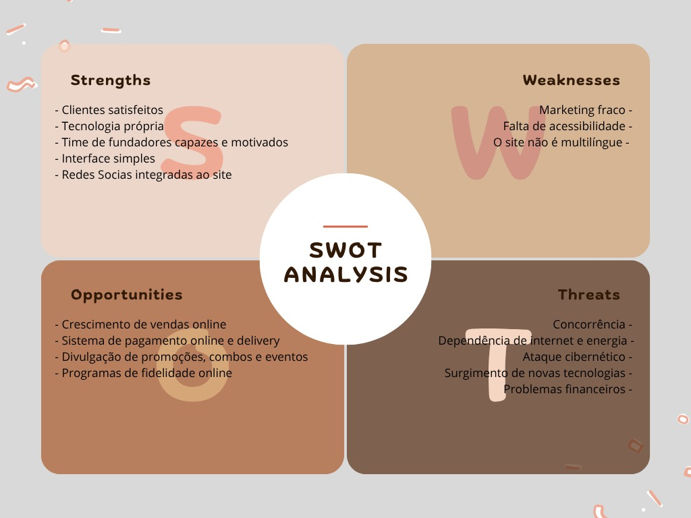

# Projeto Padaria 2025

# **Integrantes**
- [Rebeca Lima](https://github.com/Rebecaalimaa)
- [Steffany Giovanna](https://github.com/steffanygiovanna)
- [João Angra](https://github.com/joaoangra)
- [Thamye Souza](https://github.com/thamyeS)
- [Pedro Oliveira](https://github.com/Pedrokk52)

## Caminho para acessar nosso WEB e nossa API
- [API da Padaria](https://github.com/Rebecaalimaa/padaria-api)
- [WEB da Padaria](https://github.com/joaoangra/Web-Padaria-2025)

## Documentações (Caixa Branca)
- [API (Insomnia)](/Relatório%20de%20testes%20Caixa%20Branca%20(Insomnia).pdf)
- [Front (Ponta a ponta)](/Relatório%20de%20testes%20Caixa%20Branca%20(front).pdf)
  
## Documentações (Caixa Preta)
- [API (Insomnia)](/Relatorio%20de%20testes%20Caixa%20Preta%20(Insominia).pdf)
- [Front (Ponta a ponta)]( )
  
  ## Sprint Final - Backlog de Entrega (Entrega em 26 de Novembro, Apresentações 02 e 03 de Dezembro)
- [ ] Código fonte do Back-End no GitHub com README.md atualizado e implantado.(vercel)
- [ ] Código fonte do Front-End no GitHub com README.md atualizado e implantado (git pages ou vercel).
- [ ] Código fonte do Mobile no GitHub com README.md atualizado.
- [ ] Documentação do projeto atualizada no repositório principal do GitHub em formato PDF.
- [ ] Apresentação do projeto (slides, demo e documentação).
  
## Como testar 
1. Configure o ambiente de desenvolvimento com as seguintes ferramentas.

- [VsCode](https://code.visualstudio.com/)
- [XAMPP](https://www.apachefriends.org/pt_br/index.html)
- [Git](https://git-scm.com/downloads)
- [NodeJS](https://nodejs.org/pt)

2. Após a instalação das ferramentas siga esse passo para clonar o repositorio e testa-ló.

- Copie o codigo HTTP no GitHub do repositorio que queira testar, abra o Git Bash em sua area de trabalho e coloque o seguinte codígo

```bash
git clone <https://url>
```

- Agora com o repositorio clonado, entre nela com o seguinte comando

```bash
cd <nomedoarquivo>
```

- Agora dentro do arquivo clonado pelo Git Bash, digite esse comando para abri-lo no VsCode

```bash
code .
```

- Com o arquivo aberto no VsCode, abra o CMD (CRTL+"), e coloque os seguinte comandos na ordem que aparecem logo abaixo

```bash
cd api
npm i prisma -g
npm init -y
npm i express cors dotenv bcrypt jsonwebtoken
npx prisma init --datasource-provider mysql
```

- Apos colocar os comandos em ordem no CMD crie um pasta chamada .env (caso os comandos dados ja tenham criado não será necessario)

```bash
DATABASE_URL="mysql://root@localhost:3306/padaria?schema=public&timezone=UTC"
```

- Faremos a migração do banco de dados para o MySQL através do comando a seguir no terminal

```bash
npx prisma migrate dev --name init
```

## Requisitos Funcionais

- [x] - [RF001] O sistema deve permitir que o Cliente realize pedidos, escolhendo os itens desejados.
- [x] - [RF002] O sistema deve permitir que Clientes, Funcionários e Gerente verifiquem a disponibilidade de itens no estoque.
- [x] - [RF003] O sistema deve permitir que o Cliente realize o pagamento do pedido.
- [x] - [RF004] O sistema deve processar a compra, incluindo cálculo de valores, validação do pagamento e registro do pedido.
- [x] - [RF005] O sistema deve permitir que o Cliente confirme o pedido após o processamento.
- [x] - [RF006] O sistema deve permitir que o Cliente selecione a forma de recebimento (ex.: entrega por motoboy, retirada, etc).
- [RF007] O sistema deve permitir que o Funcionário atenda o cliente durante o processo de compra.
- [RF008] O sistema deve permitir que o Funcionário prepare os pedidos confirmados.
- [RF009] O sistema deve permitir que o Funcionário entre em contato com o motoboy para realizar a entrega.
- [RF010] O sistema deve permitir que o Funcionário registre a entrega do pedido.
- [RF011] O sistema deve permitir que o Gerente faça o controle geral do estoque, incluindo atualização de quantidades e entrada de mercadorias.
- [RF012] O sistema deve permitir que o Gerente faça pedidos de reposição de ingredientes.
- [RF013] O sistema deve permitir que o Gerente registre novos fornecedores no sistema.
- [RF014] O sistema deve permitir que o Gerente faça login para acessar as funções administrativas.
- [RF015] O sistema deve garantir que o Gerente só consiga fazer login se estiver cadastrado previamente.

### Diagrama de Atividades


## Trello


## Diagrama de Classes


## DER (Diagrama, Entidade e Relacionamento)


## Diagrama de Atividades


## Canvas


## Gráfico Gantt


## Matriz SWOT


## Triângulo de Ferro


//Sera?

